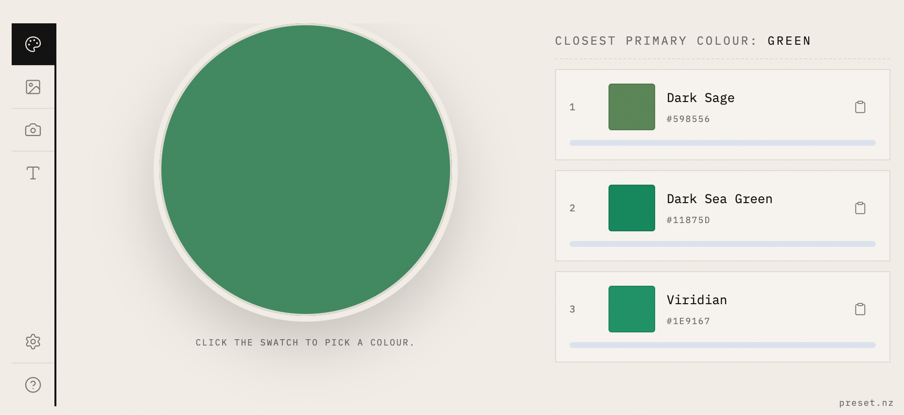

# A Colour

Pick a colour, get its name. Type a word, get its colour.

An offline-first PWA for naming colours — built for colourblind users and anyone who has ever argued about what shade something actually is.

Point your phone, paste an image, or open the colour wheel. The app finds the closest named matches from a reference set of ~980 colours, ranked by perceptual distance (Oklab — how a human eye sees the difference, not how the numbers differ).

## Input modes

**Swatch** — colour wheel with hex input and EyeDropper API support (Chromium desktop).

**Image** — paste or upload a picture, tap a pixel to sample.

**Camera** — point at something, tap the live view to sample. Pinch or scroll to zoom.

**Word** — type a noun, get a colour. Four-layer pipeline: distillation lookup → hand-curated expander (including Te Reo Māori) → TF-IDF → fine-tuned sentence transformer. No API calls at runtime.

## Colour sources

Names from the [xkcd colour survey](https://xkcd.com/color/rgb/) (public domain) and the [CSS Color spec](https://www.w3.org/TR/css-color-4/#named-colors).

## A note on accuracy

Colour is perception. The name that fits a swatch for you may not fit it for someone else, and the app can be wrong too — take the matches as a starting point, not a verdict.

## Run it

[colours.preset.nz](https://colours.preset.nz) — free, no account, works offline.
